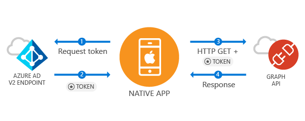

--- 
Services: active-directory
platforms: iOS
author: brandwe
level: 100
client: iOS Mobile App
service: Microsoft Graph
endpoint: AAD V2
---

# An iOS Microsoft Graph API application with Azure AD v2.0 using third party libraries

## Scenario

This app is a multi-tenant app meaning it can be used by any Azure AD tenant or Microsoft Account.  It demonstrates Azure AD's OAuth2 stanbdards compliance by demonstrating how a developer can use a third party library to build apps to connect with enterprise users and access their Azure + O365 data via the Microsoft Graph.  During the auth flow, end users will be required to sign in and consent to the permissions of the application, and in some cases may require an admin to consent to the app.  The majority of the logic in this sample shows how to auth an end user and make a basic call to the Microsoft Graph.



## Steps to Run

1. Register your application
To enable your app to get tokens, you'll first need to register it in your Azure AD tenant.

1. Sign in to the [Microsoft Developer Registration Protal](https://apps.dev.microsoft.com/).
2. Click on **Add An App** in the right corner.
3. Enter a friendly name for the application, for example 'DirectorySearcher'
4. Press **Add Platform** and select 'Native' as the Application Type. You will receive an updated set of fields that includes your **Redirect Uri**. The **Redirect Uri** is a scheme and string combination that Azure AD will use to return token responses. Since this is a third party library, you can use the built-in Reply URI of `urn:ietf:wg:oauth:2.0:oob`
5. Find the Application ID value and copy it to the clipboard. You will need this to configure your application. 


2. Install & Configure NXOAuth2
Now that you have an application in Azure AD, you can install the third party library and write your identity-related code.  In order for the third party library to be able to communicate with Azure AD, you need to provide it with some information about your app registration.
-	Begin by adding the third party library to the QuickStart project using Cocapods.

```
$ vi Podfile
```
Add the following to this podfile:

```
 platform :ios, '8.0'
 target 'QuickStart' do
 pod 'NXOAuth2Client'
 end

```

Now load the podfile using cocoapods. This will create a new XCode Workspace you will load.

```
$ pod install
...
$ open QuickStart.xcworkspace
```

-	In the QuickStart project, open the plist file `settings.plist`.  Replace the values of the elements in the section to reflect the values you input into the Azure Portal.  Your code will reference these values whenever it uses ADAL.
    -	The `clientId` is the clientId of your application you copied from the portal.
    -	The `redirectUri` is the redirect url you registered in the portal.
    -   The `graphAPI` is the Graph API we will be calling in the QuickStart. Here it is http://graph.microsoft.com
    -   The `api-version` is the API version of the Microsoft Graph API you wish to call.
    -   The `scopes` are the scopes that you will need to send to the identity service to access the Microsoft Graph API resources. Since this QuickStart will query the organizational directory on your behalf, you'll want Delegated Permissions of `Directory.Read.All` `User.Read.All`, as well as the default OAuth2 scopes `openid` and `offline_access`. Note that if you were using our Microsoft Authentication Library these default scopes would be sent for you. More information about Microsoft Graph API permissions [can be read here](https://developer.microsoft.com/en-us/graph/docs/concepts/permissions_reference).
    

3.	Use Third Party Library to Get Tokens from AAD
We recommend you visit the Third Party LIbrary README for more information on how to use the library to call OAuth2 identity providers. You can find our particular implementation in `LoginViewController.m\h`

```ObjC
 [[NXOAuth2AccountStore sharedStore] setClientID:data.clientId
                                             secret:data.secret // is nil since this is Public client
                                              scope:[NSSet setWithObject:data.scopes]
                                   authorizationURL:[NSURL URLWithString:authURL]
                                           tokenURL:[NSURL URLWithString:tokenURL]
                                        redirectURL:[NSURL URLWithString:data.redirectUriString]
                                      keyChainGroup: keychain
                                     forAccountType:@"myGraphService"];
    
    [[NSNotificationCenter defaultCenter] addObserverForName:NXOAuth2AccountStoreAccountsDidChangeNotification
                                                      object:[NXOAuth2AccountStore sharedStore]
                                                       queue:nil
                                                  usingBlock:^(NSNotification *aNotification) {
                                                      if (aNotification.userInfo) {
                                                          //account added, we have access
                                                          //we can now request protected data
                                                          NSLog(@"Success!! We have an access token.");
                                                      } else {
                                                          //account removed, we lost access
                                                      }
                                                  }];
    
    [[NSNotificationCenter defaultCenter] addObserverForName:NXOAuth2AccountStoreDidFailToRequestAccessNotification
                                                      object:[NXOAuth2AccountStore sharedStore]
                                                       queue:nil
                                                  usingBlock:^(NSNotification *aNotification) {
                                                      NSError *error = [aNotification.userInfo objectForKey:NXOAuth2AccountStoreErrorKey];
                                                      NSLog(@"Error!! %@", error.localizedDescription);
                                                  }];
}


```

- Now we need to use this token to search for users in the graph. We provide this in the `graphAPICaller.m/h` as an example. This method makes a GET request to the Azure AD Graph API to query for users whose UPN begins with the given search term.  But in order to query the Graph API, you need to include an access_token in the `Authorization` header of the request - this is where ADAL comes in.

```ObjC
+(void) searchUserList:(NSString*)searchString
       completionBlock:(void (^) (NSMutableArray* Users, NSError* error)) completionBlock
{
    if (!loadedApplicationSettings)
    {
        [self readApplicationSettings];
    }
    
    AppData* data = [AppData getInstance];
    
    NSString *graphURL = [NSString stringWithFormat:@"%@%@/users", data.graphApiUrlString, data.apiversion];
    
    NXOAuth2AccountStore *store = [NXOAuth2AccountStore sharedStore];
    NSDictionary* params = [self convertParamsToDictionary:searchString];
    
    NSArray *accounts = [store accountsWithAccountType:@"myGraphService"];
    [NXOAuth2Request performMethod:@"GET"
                        onResource:[NSURL URLWithString:graphURL]
                   usingParameters:params
                       withAccount:accounts.lastObject
               sendProgressHandler:^(unsigned long long bytesSend, unsigned long long bytesTotal) {
                   // e.g., update a progress indicator
               }
                   responseHandler:^(NSURLResponse *response, NSData *responseData, NSError *error) {
                       // Process the response
                       if (responseData) {
                           NSDictionary *dataReturned = [NSJSONSerialization JSONObjectWithData:responseData options:0 error:nil];
                           NSLog(@"Graph Response was: %@", dataReturned);
                           
                           // We can grab the top most JSON node to get our graph data.
                           NSArray *graphDataArray = [dataReturned objectForKey:@"value"];
                           
                           // Don't be thrown off by the key name being "value". It really is the name of the
                           // first node. :-)
                           
                           //each object is a key value pair
                           NSDictionary *keyValuePairs;
                           NSMutableArray* Users = [[NSMutableArray alloc]init];
                           
                           for(int i =0; i < graphDataArray.count; i++)
                           {
                               keyValuePairs = [graphDataArray objectAtIndex:i];
                               
                               User *s = [[User alloc]init];
                               s.upn = [keyValuePairs valueForKey:@"userPrincipalName"];
                               s.name =[keyValuePairs valueForKey:@"displayName"];
                               s.mail =[keyValuePairs valueForKey:@"mail"];
                               s.businessPhones =[keyValuePairs valueForKey:@"businessPhones"];
                               s.mobilePhones =[keyValuePairs valueForKey:@"mobilePhone"];
                               
                               
                               [Users addObject:s];
                           }
                           
                           completionBlock(Users, nil);
                       }
                       else
                       {
                           completionBlock(nil, error);
                       }
                       
                   }];
}
```


4. Build and Run the application


Congratulations! You now have a working iOS application using a third party library that has the ability to authenticate users, securely call Web APIs using OAuth 2.0, and get basic information about the user.  If you haven't already, now is the time to populate your tenant with some users.  Run your QuickStart app, and sign in with one of those users.  Search for other users based on their UPN.  Close the app, and re-run it.  Notice how the user's session remains intact.

## Feedback, Community Help, and Support

We use [Stack Overflow](http://stackoverflow.com/questions/tagged/msal) with the community to 
provide support. We highly recommend you ask your questions on Stack Overflow first and browse 
existing issues to see if someone has asked your question before. 

If you find and bug or have a feature request, please raise the issue 
on [GitHub Issues](../../issues). 

To provide a recommendation, visit 
our [User Voice page](https://feedback.azure.com/forums/169401-azure-active-directory).

## Contribute

We enthusiastically welcome contributions and feedback. You can clone the repo and start 
contributing now. Read our [Contribution Guide](Contributing.md) for more information.

This project has adopted the 
[Microsoft Open Source Code of Conduct](https://opensource.microsoft.com/codeofconduct/). 
For more information see 
the [Code of Conduct FAQ](https://opensource.microsoft.com/codeofconduct/faq/) or contact 
[opencode@microsoft.com](mailto:opencode@microsoft.com) with any additional questions or comments.

## Security Library

This library controls how users sign-in and access services. We recommend you always take the 
latest version of our library in your app when possible. We 
use [semantic versioning](http://semver.org) so you can control the risk associated with updating 
your app. As an example, always downloading the latest minor version number (e.g. x.*y*.x) ensures 
you get the latest security and feature enhanements but our API surface remains the same. You 
can always see the latest version and release notes under the Releases tab of GitHub.

## Security Reporting

If you find a security issue with our libraries or services please report it 
to [secure@microsoft.com](mailto:secure@microsoft.com) with as much detail as possible. Your 
submission may be eligible for a bounty through the [Microsoft Bounty](http://aka.ms/bugbounty) 
program. Please do not post security issues to GitHub Issues or any other public site. We will 
contact you shortly upon receiving the information. We encourage you to get notifications of when 
security incidents occur by 
visiting [this page](https://technet.microsoft.com/en-us/security/dd252948) and subscribing 
to Security Advisory Alerts.
